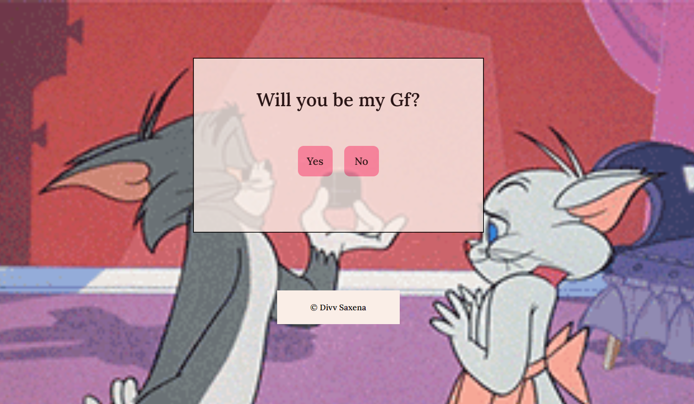

# Proposal Perfection

Welcome to the "No" Defense Website! Are you tired of facing rejection in your proposals? Fret not, because within just an hour, I've wielded my developer superpowers in HTML, CSS, and JavaScript to craft a solution that guarantees you'll never hear a "No" again!

## About

The "No" Defense Website is your ultimate tool to ensure rejection-free proposals. Armed with sleek design, seamless interactivity, and persuasive content, this website is engineered to transform your proposals into irresistible winners.

## Key Features

- **Swift Development**: Crafted within an hour using HTML, CSS, and JavaScript – a testament to the power of rapid development.

- **Sleek Visuals**: A visually appealing design that commands attention and creates an unforgettable impression.

- **Interactive Elements**: Engaging features that hold your audience's interest and make your proposal a memorable experience.

- **Persuasive Content**: Carefully curated content that not only informs but persuades, leaving no room for a negative response.

## How to Use

1. **Clone the Repository**: Begin by cloning this repository to your local machine.

2. **Navigate to the 'index.html'**: Open the `index.html` file in your preferred web browser to experience the magic.

3. **Customize Content**: Edit the HTML to tailor the content to your proposal's specifics. Replace placeholder text with your own persuasive language.

4. **Style Your Proposal**: If you're a CSS aficionado, feel free to enhance the design further by modifying the `style.css` file.

5. **Add Interactivity**: The `script.js` file is your playground for adding interactive elements that engage and impress your audience.

6. **Launch Your Success**: Once you're satisfied with your proposal's digital transformation, share the URL or deploy it to a web server to present your pitch with flair.

## Inspiration

Inspired by the desire to banish rejection and fueled by developer enthusiasm, the "No" Defense Website was brought to life in record time. It's a testament to the potential of blending technical skills with creativity.

## Disclaimer

While the "No" Defense Website significantly boosts your proposal's chances of success, it doesn't provide guaranteed "Yes" responses. Remember, even the most impeccable websites can't replace a well-crafted proposal.

## Contribute

If you're excited about battling the rejection blues, feel free to contribute to this repository. Whether it's refining the design, enhancing interactivity, or suggesting improvements, your collaboration is welcome!

## Let's Defend Against "No"!

Ready to revolutionize your proposal game? Clone this repository, unleash your developer prowess, and witness the transformation firsthand. Say goodbye to "No" – it's time to embrace success!

